# "Gitlab" - Дрибноход Давид
Файлы:  
[gitlab-CI](./files/.gitlab-ci.yml)  
[Dockerfile](./files/Dockerfile)

## DevOps
Выполнил pipeline:  
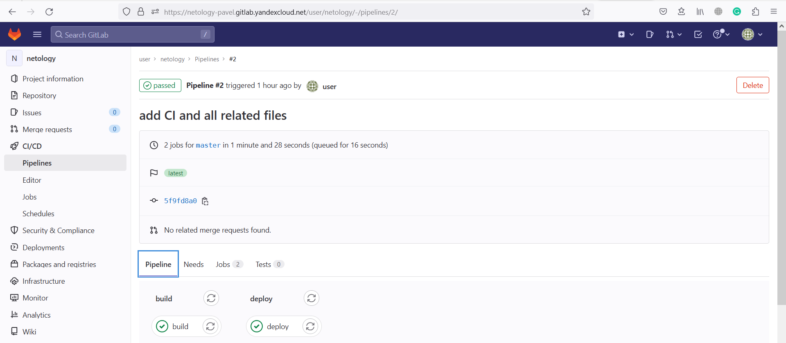  
build stage:  
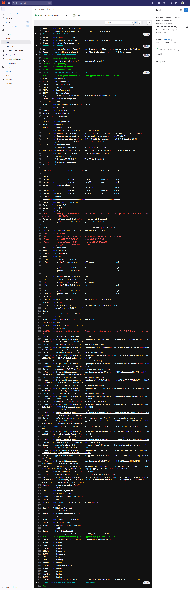  
deploy stage:  
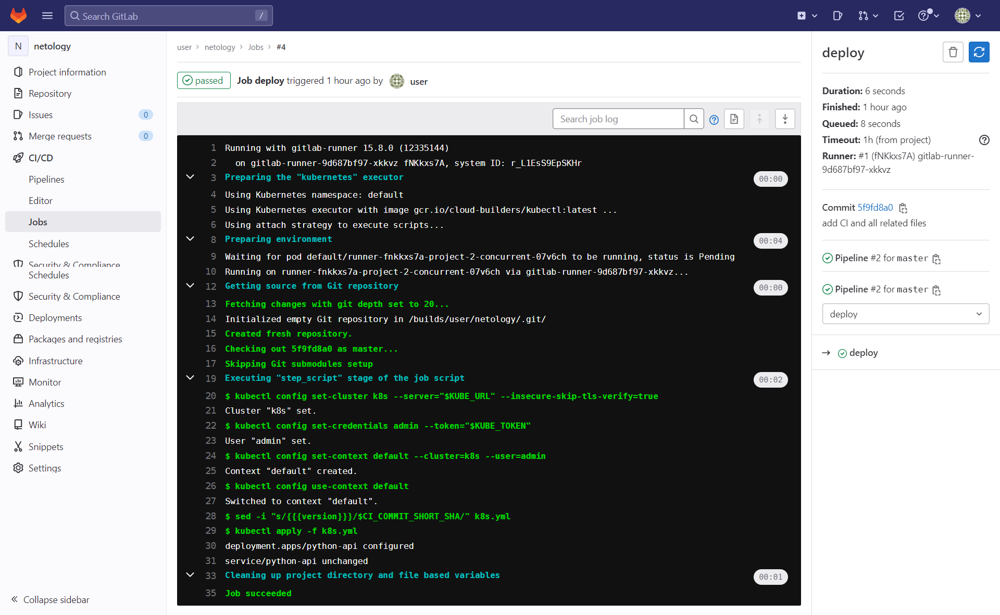  
Отрабатывающий curl запрос к серверу:  
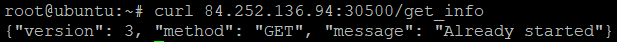

## Product Owner
Issue создан:  
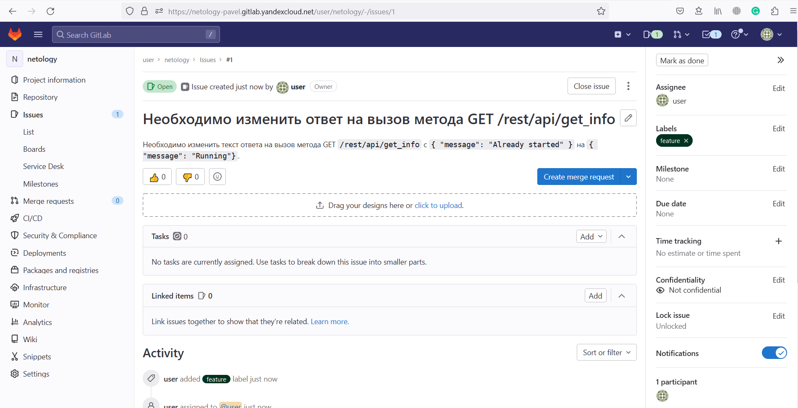

## Developer
Ветка под issue создана:  
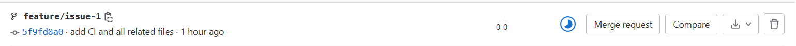
Необходимые изменения внесены:  
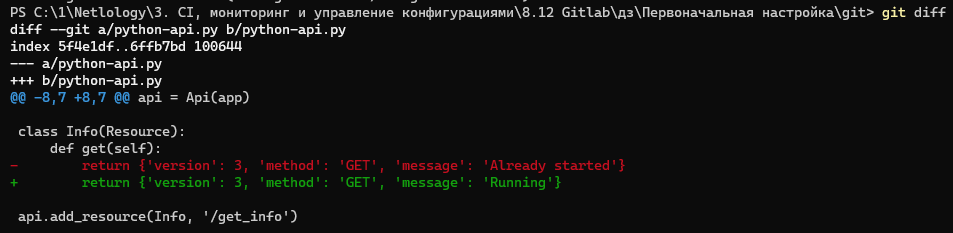  
Merge request создан, сборка прошла успешно:  
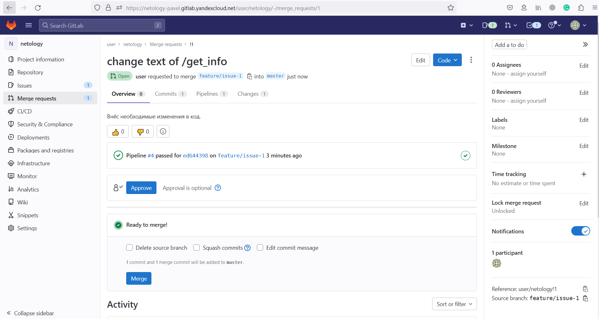  

## Tester
Контейнер запущен, запрос выполняется успешно:  
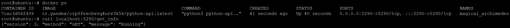  
Merge request одобрен и выполнен:  
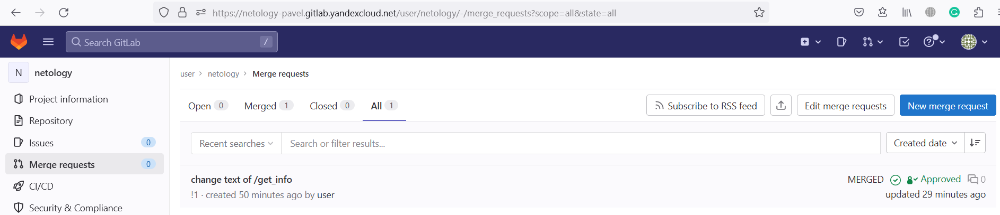  
Issue закрыта с соответствующим комментарием:  
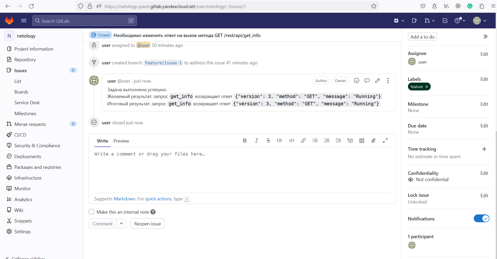
